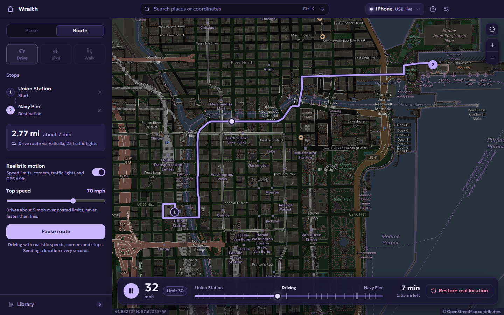
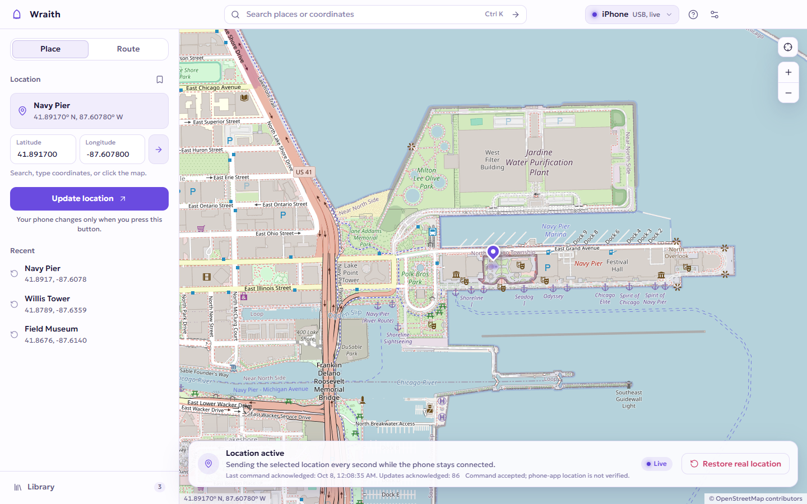

# Wraith

Set your phone's location from your computer: hold it at a fixed place, or send it
along real roads at a believable pace, as a drive, a bike ride or a walk. Wraith works
with iPhone and Android, over a USB cable or Wi-Fi, on Windows, macOS and Linux.



**[Download Wraith 0.3.1](https://github.com/tootsalot/Wraith-Location/releases/latest)** for Windows, Mac or Linux, then follow the
[setup guide](SETUP.md) to connect your phone.

Wraith is free software under the GNU GPL v3 or later.

## Install

**Windows 10 or 11 (64-bit):** download `Wraith-0.3.1-win-x64.exe` from the
[latest release](https://github.com/tootsalot/Wraith-Location/releases/latest) and run it. The
installer isn't code-signed yet, so Windows SmartScreen may warn you; choose
**More info → Run anyway** if you trust the download. Each release lists a SHA-256
checksum you can compare against.

**macOS:** download `Wraith-0.3.1-mac-arm64.dmg` for a Mac with an Apple chip, or
`Wraith-0.3.1-mac-x64.dmg` for an Intel Mac. It isn't signed or notarized; if macOS
blocks it, use **System Settings → Privacy & Security → Open Anyway**.

**Linux (64-bit):** install `Wraith-0.3.1-linux-amd64.deb` on Ubuntu or Debian, or run
`Wraith-0.3.1-linux-x86_64.AppImage` elsewhere. See the [setup guide](SETUP.md#download-and-open)
for details.

Mac and Linux builds are new in 0.3.0 and untested on real phones. Please
[open an issue](https://github.com/tootsalot/Wraith-Location/issues) with what works.

The app includes everything it needs to talk to phones. You don't need Python,
Node.js, Android Studio or an account.

## Using Wraith

### Hold a place

Choose **Place**, then search, type coordinates, or click the map. Nothing changes on
your phone until you press **Set location**. While a location is live, the bar at the
bottom of the map shows when the phone last acknowledged it, and **Restore real
location** hands the phone back its real GPS.

A held place drifts slowly by a few metres around its exact spot, like real GPS on a
phone that isn't moving. Choose **Off**, **Subtle** (the default, about 2–3 m) or
**Normal** (about 5 m) under **Natural drift** in Settings. A route's destination
drifts the same way after you arrive.



### Follow a route

Choose **Route** and a travel mode: **Drive**, **Bike** or **Walk**. Click the map to add
stops in order (up to 12), or add search results and typed coordinates with **Add
selected pin**. Drag stops in the list or on the map to change them, then press
**Plan route** to see the path, distance and estimated time. **Start route** moves the
phone to the first stop and sends a new position every second.

With **Realistic motion** on, Wraith moves like a person would:

- Drivers keep to about 5 mph over the posted limit, never above your **Top speed**.
- Everyone accelerates and brakes smoothly and slows for corners.
- Some traffic lights are red: roughly one in four, usually for 5 to 15 seconds,
  and less often straight after a stop.
- Cyclists and walkers move a little below the speed you set.
- The reported position drifts a few metres, like real GPS, and arrival lands
  exactly on the destination.

Turn realism off to move at exactly the chosen speed. Both settings can change
while a route runs. The playback bar shows your speed, the limit, the lights ahead
and the time left; **Pause** holds the current point.

### Wander

Choose **Wander**, set a centre by clicking the map, searching or typing coordinates,
then pick a radius (50 m to 2 km) and a walking pace. **Start wandering** moves the
phone to the centre, then walks real footpaths to random spots inside the circle,
lingering 30 seconds to 3 minutes at each before moving on. The playback bar shows
whether it's walking or lingering, the spots visited and the distance walked. Without
internet, it walks in straight lines inside the circle.

### After you arrive

The phone stays at the destination. Plan another route, press **New route from
here** to start from where the phone is, or switch to **Place** to hold somewhere
else. None of this needs a trip back to your real location first.

### Library and GPX

Open **Library** to reuse saved places and routes. A saved route keeps its full path,
so it replays without planning again or going online. **Import GPX** turns a recorded
track into a route that follows it exactly, at its recorded speeds when the file has
timestamps; a short GPX route becomes stops to plan. **Export GPX** saves the current
route.

### Wi-Fi

After a working USB session, Wraith offers to switch the phone to Wi-Fi. The current
place carries over and a running route continues. Android 11 and later can also
pair without a cable. See the [Wi-Fi guide](SETUP.md#connect-over-the-same-wi-fi-network-017).

### Notifications

When Wraith isn't the window in front, it can show a desktop notification when a route
arrives, a phone needs attention, a route pauses itself, or a phone reconnects. Each
can be switched off under **Notifications** in Settings.

### Optional API keys

Wraith works without any key. A free [Geoapify](https://www.geoapify.com/) key,
added under **Free API keys** in Settings, gives better place search and real names
for dropped pins, within a free allowance of 3,000 credits a day. Wraith uses it
only when you search, or set or save a pin. It shows roughly how many credits it has
used today, and switches back to the free services at the limit. See
[docs/api-keys.md](docs/api-keys.md).

### Appearance

Wraith follows your system's light or dark setting. Choose **Dark** or **Light** in
Settings to override it.

## Phone requirements

- **iPhone:** iOS 17.4 or later, with Developer Mode turned on. Windows also needs
  Apple's USB drivers (install the Apple Devices app). The first **Prepare** needs
  internet and can take a few minutes.
- **Android:** Android 8 or later, with USB debugging on. **Prepare** installs the
  Appium Settings helper and selects it as the mock-location app. No root needed.
  Some Windows PCs need the phone maker's ADB driver.

The [setup guide](SETUP.md) walks through all four computer and phone combinations.
Wraith never removes passcodes or changes Find My.

## How sessions behave

- **One phone at a time.** Restore the current phone before using another.
  Selecting a pin only changes the preview; your phone moves only when you press
  **Set location**, **Update location** or **Start route**.
- **What "acknowledged" means.** On iPhone, Wraith re-sends the location every second
  and records each acknowledgement. On Android, the helper re-sends it every two
  seconds and Wraith reads back its coordinates. Neither proves which location
  another app is using, so check the result in that app.
- **Disconnects.** If the cable or Wi-Fi drops, Wraith waits and reconnects the same
  phone to the same target while it stays open. Routes pause on a disconnect,
  sleep or slow updates, and continue when you press **Resume**.
- **Restoring.** **Restore real location** stops the simulation and cancels any
  automatic reconnect. Quitting restores by default; if that fails, Wraith asks
  before quitting and keeps a record so you can **Retry** or **Restore** next time.
  After a restart, nothing resumes on its own.
- **When restore can't happen.** Unplugging, sleep, a force-quit or a crashed helper
  can leave the phone at its simulated location. Reconnect and press **Restore**, or
  restart the phone. If a different phone is connected while an old session is
  unresolved, Wraith discards the old record without contacting the old phone.

## Privacy and online services

Wraith has no account, telemetry or analytics, and keeps no location history online.
Your settings, saved places and saved routes stay in local files on your computer.
It contacts these services only:

| Service | When | What is sent |
| --- | --- | --- |
| OpenStreetMap tiles | While the map is visible | Map tile requests |
| Photon (komoot) | When you submit a search | Your search text |
| Geoapify, only if you add a key | When you submit a search, or set or save a dropped pin | Your search text or the pin's coordinates, with your key |
| Valhalla (FOSSGIS), with OSRM as fallback | When you press **Plan route**, and for each walk in wander mode | Stop coordinates, then the planned path for road data |

Playing a route, saved routes and GPX files make no online requests. The public
Photon, Valhalla and OSRM services are free for reasonable use, with no uptime
guarantee; you can point search at another Photon server in Settings. Geoapify is
used only with your own key and never with results cached. See
[THIRD_PARTY_NOTICES.md](THIRD_PARTY_NOTICES.md).

## Build from source

You need Node.js 24 LTS and npm. Building the iPhone helper also needs Python 3.12
or 3.13.

```sh
npm ci
npm run runtime:prepare
npm run pack
```

`npm run pack` creates a runnable app in `release/` (`release/win-unpacked/Wraith.exe`
on Windows). `npm run dist` builds the installer instead (an AppImage and a .deb on
Linux). Build on the operating system you're targeting: Windows x64, macOS Apple
Silicon, macOS Intel and Linux x64 are supported; Windows on ARM and ARM Linux are
not yet.

If Python isn't installed, [uv](https://docs.astral.sh/uv/) can provide one without a
system-wide install:

```sh
uv python install 3.12
WRAITH_BUILD_PYTHON="$(uv python find 3.12)" npm run runtime:prepare
```

In PowerShell, run `$env:WRAITH_BUILD_PYTHON = (uv python find 3.12)` first. The
runtime step downloads Python packages, Google's platform tools and the Android
helper. It doesn't change any phone settings.

For development, `npm run dev` runs the app with live reload. `npm run preview` shows
the interface in a browser, without phone control.

The packaging check refuses to build an app with missing or mismatched phone
runtimes. Installers are unsigned; a trusted macOS launch and a recognised Windows
publisher need signing credentials. The GitHub Actions workflow in
`.github/workflows/build.yml` builds unsigned installers for all four targets as
workflow artifacts.

To release, set the version in `package.json`, rename CHANGELOG.md's "Unreleased"
heading to that version, then push a matching tag (for example `v0.3.0`).
`.github/workflows/release.yml` builds every target, writes `SHA256SUMS.txt` and
creates a draft GitHub release with the changelog section. Review the draft, then
publish it.

## Tests

| Command | What it checks |
| --- | --- |
| `npm test` | Device targeting, sessions, reconnection and recovery, route planning and fallback, realistic motion, playback timing, saved routes and GPX, optional API keys and the credit meter |
| `npm run test:renderer-session` | The interface against a fake phone: controls stay stable through live updates, and routes plan, start, pause and resume |
| `npm run test:native` | The real app with read-only phone discovery, live search and route planning. It never sets or restores a location |
| `npm run test:ios-stream` | The iPhone bridge end to end, with only the phone connection simulated |

Set `WRAITH_SMOKE_EXECUTABLE` to a packaged app and run `node scripts/smoke-electron.mjs`
to check a build. Automated tests use simulated phones; real-device results are
tracked in [docs/hardware-test-matrix.md](docs/hardware-test-matrix.md).

## License

Wraith is free software under the GNU General Public License v3.0 or later. See
[LICENSE](LICENSE) and [THIRD_PARTY_NOTICES.md](THIRD_PARTY_NOTICES.md). Map data ©
OpenStreetMap contributors. See [CHANGELOG.md](CHANGELOG.md) for release history.
